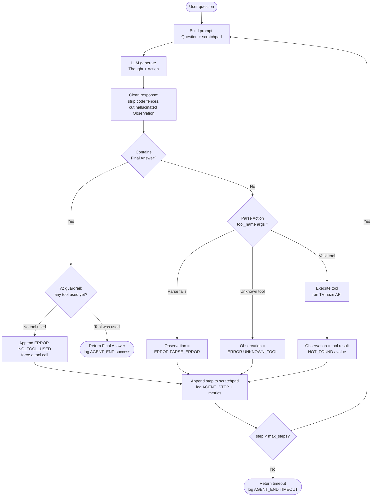

# ReAct Agent — Logic Flowchart

This diagram shows the Thought → Action → Observation loop implemented in
`src/agent/agent.py`, including the v2 guardrail and error paths captured by
telemetry.

## Reading the trace

Every node above emits a structured JSON log event:

- `AGENT_START` / `AGENT_END` — run boundaries (with `version`, `status`).
- `AGENT_STEP` — one Thought/Action/Observation, or an error code
  (`PARSE_ERROR`, `UNKNOWN_TOOL`, `NO_TOOL_USED`).
- `LLM_METRIC` — tokens, latency and cost for each `LLM.generate` call.

`analyze_logs.py` reconstructs runs from these events to compute reliability
per prompt version.
